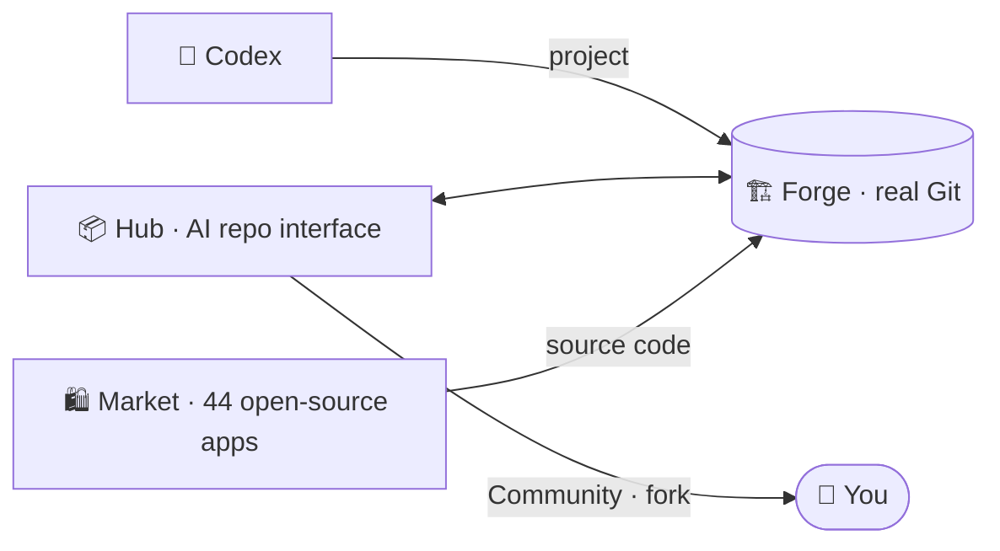

<div align="center">


# 📦 Numex Hub

### Repository management and AI-assisted development — with a single Numex account.

[](https://hub.numexai.com.tr)
[](https://hub.numexai.com.tr/topluluk)
[](https://github.com/numexai/numex-forge)

[🇹🇷 Türkçe](README.md) · 🇬🇧 **English**

</div>

---

> Create and manage Git repositories, and edit them with AI. Sign in to Numex and Hub and Forge are ready for you.
> **No separate sign-up, no separate password: one Numex account for the whole ecosystem.**

> ℹ️ Hub's interface is in Turkish. The screenshots below show the Turkish UI.


## What does Hub do?

| Feature | Description |
|---|---|
| 📦 **Git repository management** | Create repos, edit files, browse commit history. Repos live on [Numex Forge](https://github.com/numexai/numex-forge): real Git. |
| 🤖 **AI-assisted editing** *(beta)* | Type *"update the README"* in the chat; the AI proposes a code block, you approve, it is committed to Forge. |
| 💬 **Repo-aware chat** *(beta)* | The AI knows your repo's files: *"add a function to index.js"* → it reads the file and proposes the change. |
| ⚡ **Instant apply** *(beta)* | Review the proposal, press **Apply** → instant commit. See its SHA and revert if needed. |
| 🔐 **One account** | Sign in with Google or GitHub; Hub and Forge are enabled automatically. |

## 🌍 Community Showcase *(NEW)*

- ⭐ **Trending repositories**: featured projects with language tags, star and fork counts
- 🍴 **Fork**: copy a repo you like to your account in one click and build on it
- 🔍 **Search** repositories
- 📡 **Live Feed (Live Numex Network)**: push, fork, star and PR activity in real time

## How it works: 4 steps, nothing to install

1. **Sign in to Numex** at [numexai.com.tr](https://numexai.com.tr) with Google or GitHub.
2. **Open Hub** at [hub.numexai.com.tr](https://hub.numexai.com.tr); you arrive signed in.
3. **Tell the AI what to change**: *"update the README"*, *"add a new function"*.
4. **Apply → commit to Forge**: it shows up in history and can be reverted any time.

## Working locally

Every Hub repository is a real Git repository on Forge:

```bash
git clone https://forge.numexai.com.tr/<user>/<repo>.git
```

## 📚 Documentation (Turkish)

[Getting started](docs/baslangic.md) · [Community Showcase](docs/topluluk.md) · [Hub and Forge](docs/hub-ve-forge.md) · [FAQ](docs/sss.md)

🐞 Found a bug or have an idea? → [Open an issue](https://github.com/numexai/numex-hub/issues/new/choose)

## Where it fits



---

<div align="center">

**Numex Family** · [Numex AI](https://numexai.com.tr) · [Codex](https://github.com/numexai/numex-codex) · [Okul](https://github.com/numexai/numex-okul) · [Market](https://market.numexai.com.tr) · [Numexpedia](https://github.com/numexai/numex-pedia) · [Hub](https://github.com/numexai/numex-hub) · [Forge](https://github.com/numexai/numex-forge) · [API](https://github.com/numexai/numex-api) · [SDK](https://github.com/numexai/numex-sdk) · [Pusulam](https://github.com/numexai/pusulamx) · [PC Doktoru](https://github.com/mobilcep/pcdoktoru)

*The Turkish AI that puts people first* 🇹🇷 · [Whole ecosystem →](https://github.com/numexai/numex_nedir)

</div>
