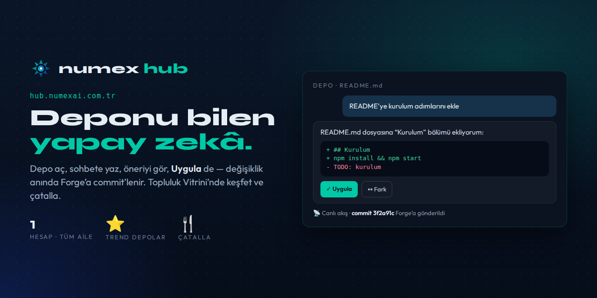
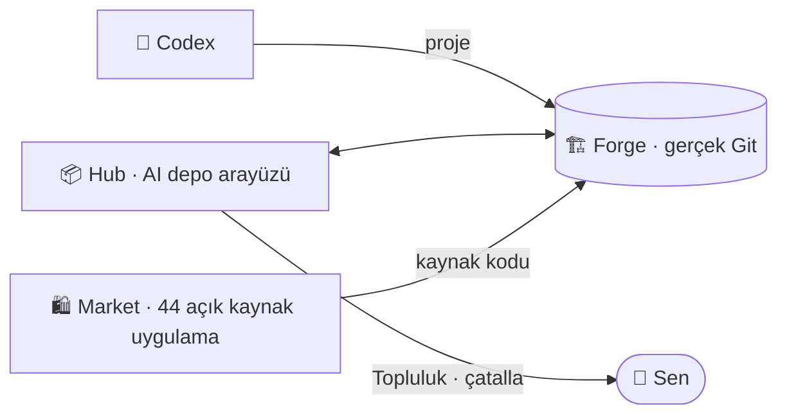

# 📦 Numex Hub

### Depo yönetimi ve AI destekli geliştirme — tek Numex hesabıyla.

🇹🇷 **Türkçe** · [🇬🇧 English](README.en.md)

---

> Git depolarını oluştur, yönet, AI ile düzenle. Numex'e giriş yap, Hub'ı ve Forge'u otomatik kullan.
> **Ayrı kayıt yok, ayrı şifre yok — tek Numex hesabı, tüm ekosistem.**

## Hub ne yapar?

| Özellik | Açıklama |
|---|---|
| 📦 **Git depo yönetimi** | Depo oluştur, dosyaları düzenle, commit geçmişini gör. Depolar [Numex Forge](https://github.com/numexai/numex-forge) üzerinde — gerçek Git. |
| 🤖 **AI destekli düzenleme** *(beta)* | Sohbete *"README'yi güncelle"* yaz; AI kod bloğu önersin, onayla, Forge'a commit'lensin. |
| 💬 **Depo bağlamlı sohbet** *(beta)* | AI deponun dosyalarını bilir: *"index.js'ye fonksiyon ekle"* → dosyayı okur, değişikliği önerir. |
| ⚡ **Anlık uygulama** *(beta)* | Öneriyi gör, **Uygula** de → anında commit. SHA'sını gör, gerekirse geri al. |
| 🔐 **Tek hesap** | Google veya GitHub ile giriş; Hub ve Forge otomatik açık. |

## 🌍 Topluluk Vitrini *(YENİ)*

> *"Binlerce geliştiricinin inşa ettiği otonom projeleri keşfedin. Kendi vizyonunuzla birleştirin ve
> sınırları kaldırın."*

- ⭐ **Trend Depolar** — dil etiketi, yıldız ve çatal sayılarıyla öne çıkan projeler
- 🍴 **Çatalla** — beğendiğin depoyu tek tıkla kendi hesabına al, üzerine geliştir
- 🔍 **Depolarda ara**
- 📡 **Canlı Akış (Canlı Numex Ağı)** — push, fork, star, PR etkinlikleri anında

Üst menü: **Uygulama Marketi** · **Topluluk** · **Dokümantasyon** · **Panoya Dön**

## Nasıl çalışır? — 4 adım, kurulum yok

1. **Numex'e giriş yap** — [numexai.com.tr](https://numexai.com.tr)'de Google veya GitHub ile.
2. **Hub'ı aç** — [hub.numexai.com.tr](https://hub.numexai.com.tr); giriş yapmış halde gelirsin.
3. **AI'a değişikliği söyle** — *"README'yi güncelle"*, *"yeni fonksiyon ekle"*.
4. **Uygula → Forge'a commit** — geçmişte görünür, istediğinde geri alınır.

## 📚 Belgeler

| | |
|---|---|
| 🚀 [Hub'a başlarken](docs/baslangic.md) | Giriş, depo oluşturma, AI ile düzenleme, Uygula → commit |
| 🌍 [Topluluk Vitrini](docs/topluluk.md) | Trend depolar, çatallama, arama, Canlı Akış |
| 🏗️ [Hub ve Forge](docs/hub-ve-forge.md) | Depolar nerede durur, bilgisayarına nasıl klonlanır |
| ❓ [SSS](docs/sss.md) | Sık sorulan sorular |

🐞 Hata mı buldun, fikrin mi var? → [Issue aç](https://github.com/numexai/numex-hub/issues/new/choose)

## Ekosistemdeki yeri

---

**Numex Ailesi** · [Numex AI](https://numexai.com.tr) · [Codex](https://github.com/numexai/numex-codex) · [Okul](https://github.com/numexai/numex-okul) · [Market](https://market.numexai.com.tr) · [Numexpedia](https://github.com/numexai/numex-pedia) · [Hub](https://github.com/numexai/numex-hub) · [Forge](https://github.com/numexai/numex-forge) · [API](https://github.com/numexai/numex-api) · [SDK](https://github.com/numexai/numex-sdk) · [Pusulam](https://github.com/numexai/pusulamx) · [PC Doktoru](https://github.com/mobilcep/pcdoktoru)

*İnsanı önce koyan Türk yapay zekâsı* 🇹🇷 · [Tüm ekosistem →](https://github.com/numexai/numex_nedir)

