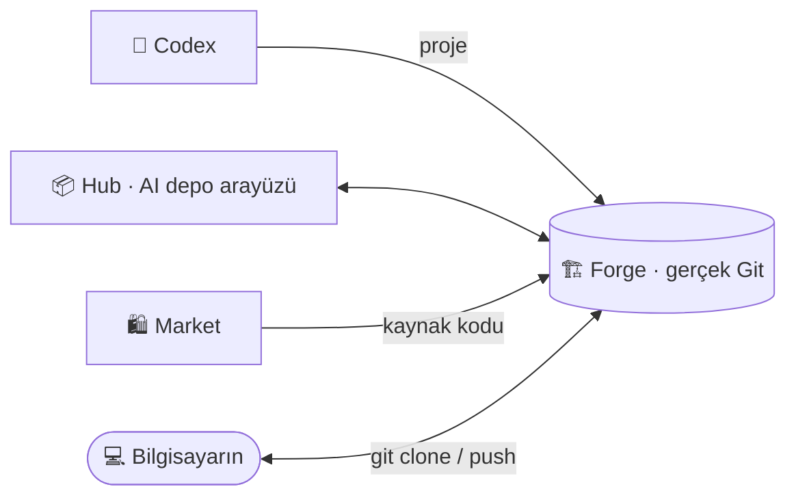

# 🏗️ Hub ve Forge

Hub bir **arayüz**, Forge ise **Git sunucusudur**. Hub'da gördüğün her depo aslında Forge'da duran
gerçek bir Git deposudur.

| 🏗️ **Forge** | 📦 **Hub** |
|---|---|
| Git sunucusu (Gitea tabanlı, Türkçe) — depoların **evi** | Forge üzerinde çalışan **AI destekli arayüz** |
| Konular (issues), değişiklik istekleri (PR), kilometre taşları | "README'yi güncelle" de → öneri → Uygula → commit |
| `git clone`, `git push`, dallar, etiketler | Depo bağlamlı sohbet, anlık uygulama, Topluluk Vitrini |



## Depoyu bilgisayarına al

Hub'da çalıştığın depo Forge'da `<kullanıcı>/<depo>` adıyla durur:

```bash
git clone https://forge.numexai.com.tr/<kullanıcı>/<depo>.git
cd <depo>
# ... düzenle ...
git add -A && git commit -m "değişiklik"
git push
```

Bilgisayarından gönderdiğin commit'ler Hub'da da görünür; Hub'da AI ile yaptığın commit'ler de
`git pull` ile bilgisayarına gelir. Terminal, VS Code veya Codex IDE, normal bir Git sunucusu gibi çalışır.

## Hangisini ne zaman kullanmalı?

- **Hızlı değişiklik, AI yardımı** → Hub
- **Konular, PR incelemesi, kilometre taşları, ekip/organizasyon** → Forge
- **Büyük geliştirme, kendi editörün** → Forge'dan klonla, bilgisayarında çalış

---

[← Topluluk Vitrini](topluluk.md) · [SSS →](sss.md)
